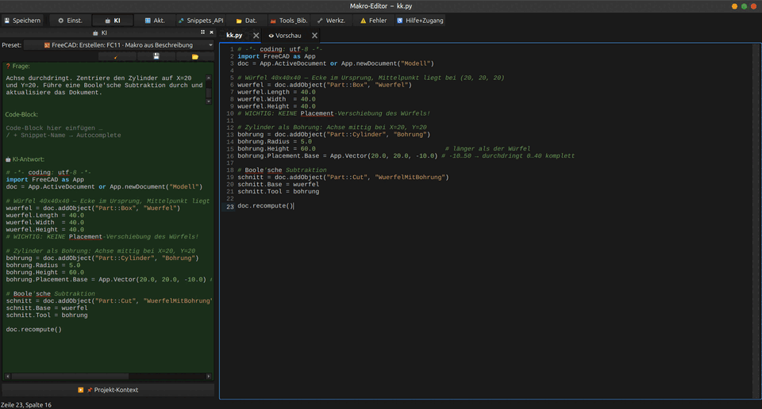

# FreeCAD MultiAI Panel

A modern, AI-assisted Python editor as a FreeCAD plugin with freely arrangeable panels,
syntax highlighting, 19 supported AI providers, and extensive tools for
FreeCAD automation.

---

## Project Philosophy

Technology should make things easier—not create new barriers.

This project is designed to make AI-assisted FreeCAD development accessible to everyone: experienced professionals, beginners, students, hobbyists, and people with accessibility needs.

Accessibility is a core design principle. The workbench provides multiple experience levels, integrated help, keyboard accessibility, and AI-assisted guidance so that more people can use and learn FreeCAD with confidence.

### AI as a Tool

This project does **not** treat artificial intelligence as a replacement for human knowledge or creativity.

Instead, AI is considered a tool—like a compiler, a calculator, or a CAD application. Its purpose is to support the user by answering questions, explaining concepts, suggesting solutions, assisting with debugging, and helping to improve code.

The user always remains in control. Every decision and every final result belongs to the person using the software.

### No AI Is Perfect

Like every AI system, the integrated AI can make mistakes, misunderstand requirements, or generate incorrect code. AI-generated content should therefore always be reviewed before it is used.

The goal of this project is **not** to automate thinking or replace developers. Its goal is to help people learn, become more productive, solve problems more easily, and lower the barriers to FreeCAD development.

If the AI helps a beginner understand something new, enables an experienced user to work more efficiently, or makes development more accessible for someone with disabilities, then it has fulfilled its purpose.

---

## Preview

> *Recording tool: [Peek](https://github.com/phw/peek) on Linux*

---

## Quick Start

1. **Install required package:** `pip install requests`
2. **Clone/download the repo** and place it in the FreeCAD `Mod` folder (folder name: `FreeCAD_MultiAI_Panel`, no spaces)
3. **Restart FreeCAD** and select the workbench **"FreeCAD MultiAI Panel"**
4. **Set up an AI provider** in the welcome dialog (e.g. locally with Ollama or with your own API key) — done!

> OS-specific installation paths (Linux/Flatpak/Windows/macOS): **[Requirements & Installation](docs/requirements.md)**

---

## Highlights

- **AI-assisted Python editor** for FreeCAD — multi-tab, syntax highlighting, Jedi autocomplete, light/dark theme
- **19 AI providers** (Ollama local, Claude, ChatGPT, Gemini, DeepSeek, Groq, …) with 40+ presets
- **Run in FreeCAD** — F5 runs the whole macro, F9 runs the selection; press again to abort
- **Generate macros from plain language** (FC11–FC14) and see the result in an embedded **👁 3D preview**
- **Unified error panel** — translate errors to German in place, let the AI explain or auto-fix them
- **🎤 Voice control** — navigate panels/actions and dictate text, fully **offline** (Vosk), no external provider
- **10 dock panels**, freely arrangeable; interactive assistant and built-in searchable help
- **Accessibility-first** — experience levels, keyboard mode, font/contrast options, voice input
- Runs on Linux (AppImage/Flatpak), Windows and macOS with FreeCAD 0.21+

→ Full list: **[Feature Overview](docs/feature-overview.md)**

---

## Documentation

The pages are ordered as a guided read — each one links to the previous and next page (← Prev · Home · Next →), so you can page through them like a book.

| Topic | Document |
|-------|----------|
| 1 · Quick start | [quick-start.md](docs/quick-start.md) |
| 2 · Requirements & installation | [requirements.md](docs/requirements.md) |
| 3 · First start & welcome dialog | [erststart.md](docs/erststart.md) |
| 4 · The user interface | [oberflaeche.md](docs/oberflaeche.md) |
| 5 · Panels in detail | [panels.md](docs/panels.md) |
| 6 · Full feature overview | [feature-overview.md](docs/feature-overview.md) |
| 7 · Voice control (offline) | [sprachsteuerung.md](docs/sprachsteuerung.md) |
| 8 · AI workflow & presets | [ki-workflow.md](docs/ki-workflow.md) |
| 9 · AI provider setup (19) | [setting-up-ai-providers.md](docs/setting-up-ai-providers.md) |
| 10 · FC11–FC14 – macro from description | [makro-generator.md](docs/makro-generator.md) |
| 11 · Snippets, API hints & tools panel | [snippets-und-werkzeuge.md](docs/snippets-und-werkzeuge.md) |
| 12 · Macro library | [makro-bibliothek.md](docs/makro-bibliothek.md) |
| 13 · Error panel & backup system | [fehler-und-backup.md](docs/fehler-und-backup.md) |
| 14 · Keyboard shortcuts | [keyboard-shortcuts.md](docs/keyboard-shortcuts.md) |
| 15 · Ollama – field report | [OLLAMA_ERFAHRUNGEN.md](docs/OLLAMA_ERFAHRUNGEN.md) |
| 16 · Project structure | [project-structure.md](docs/project-structure.md) |
| 17 · Known limitations | [known-limitations.md](docs/known-limitations.md) |

---

## License

MIT — see [LICENSE](LICENSE). Free to use, modify and share.
